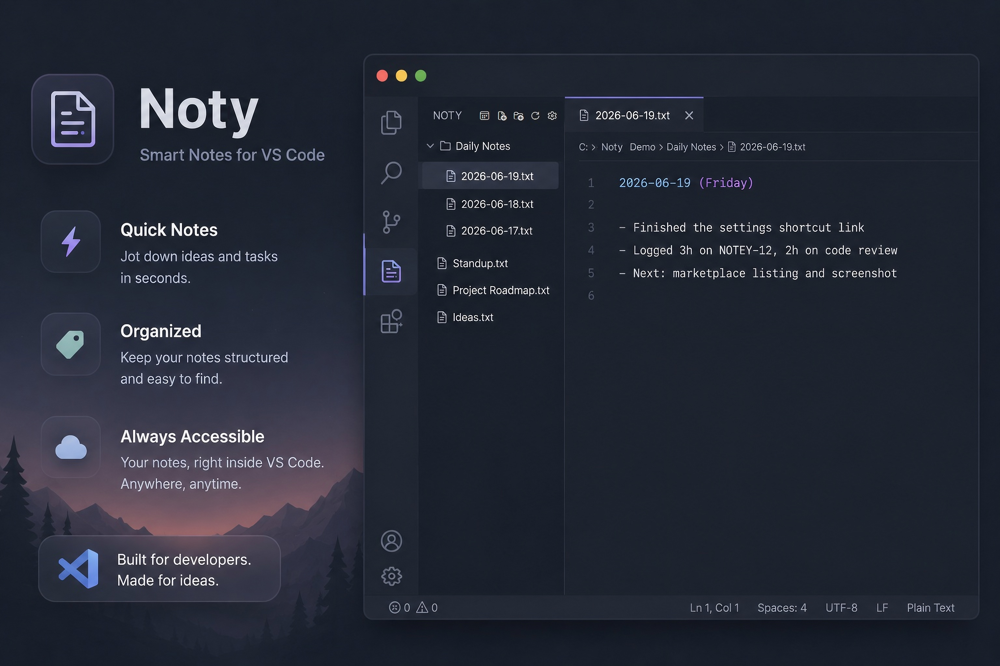

# Noty

**A simple, private, fast notes sidebar for VS Code.**

---

Noty is built for daily journaling and keeping a work log: press one key and today's dated note opens, ready to write. But it is just as good for the rest of your notes - keep them in a folder, see them all in the sidebar, and open any of them in a click, without leaving VS Code or opening a separate notes app.

## Features

- A notes sidebar that browses any folder you choose.
- One-key daily notes (default `Ctrl+Alt+J`), named with today's date - made for journals and work logs.
- Create, rename, delete, and **drag and drop** notes and folders to organize them.
- Send daily notes to their own subfolder (for example, `Daily Notes`), or keep everything together.
- Customizable date format, file extension, and template.
- Private and lightweight: plain local files, no account, no telemetry, no dependencies.

## Quick start

1. Click the **Noty** icon in the activity bar.
2. Click **Choose Folder** and pick where your notes live.
3. Press `Ctrl+Alt+J` for today's note - or use the toolbar to add any note or folder.

## Settings

| Setting | What it does | Default |
| --- | --- | --- |
| `noty.folder` | The folder where your notes are stored. | (empty) |
| `noty.dailyNoteSubfolder` | Subfolder for daily notes. | (empty) |
| `noty.dailyNoteDateFormat` | How daily note files are named. | `YYYY-MM-DD` |
| `noty.dailyNoteTemplate` | Text inserted into a new daily note (`{date}`, `{day}`). | `{date} ({day})` |
| `noty.fileExtension` | File type used for all notes. | `txt` |

## Keyboard shortcut

The daily-note shortcut defaults to `Ctrl+Alt+J`. To change it, open the Command Palette and run **Noty: Change Daily Note Shortcut**, or press `Ctrl+K Ctrl+S` and search **New Daily Note**.

## License

[MIT](LICENSE) (c) Johann Wirt
